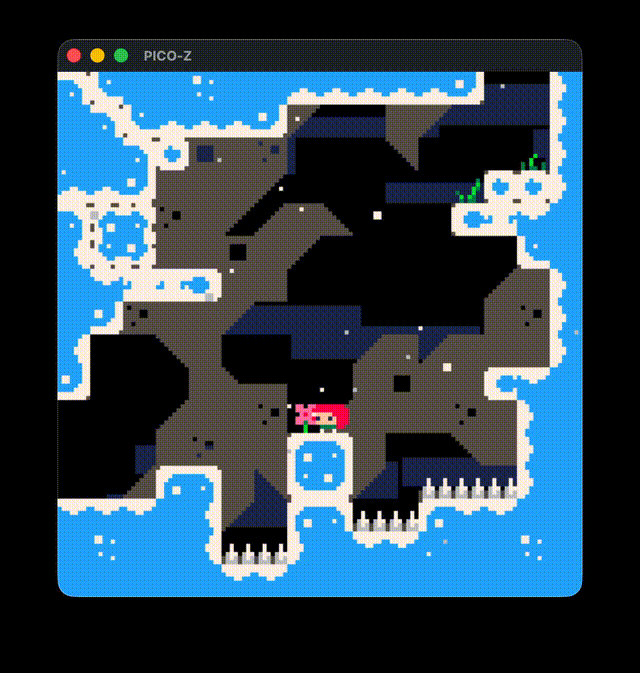

# PICO-Z

A PICO-8 emulator with save states. Plays `.p8` and `.p8.png` carts on macOS, Windows, Linux, and [in the browser](https://mnmlyw.github.io/pico-z/play/).

Built with Zig, ziglua (Lua 5.2), and SDL3. Web version compiles to WASM (356KB, no Emscripten).



> **Note:** PICO-Z is a player/emulator only — it does not include PICO-8's editor, splore, or game creation tools. You still need [PICO-8](https://www.lexaloffle.com/pico-8.php) to make games.

## Try It

**[Play in Browser](https://mnmlyw.github.io/pico-z/play/)** — open any `.p8` or `.p8.png` cart directly in your browser. No install needed.

## Build & Run

Requires Zig 0.15+.

```bash
zig build                      # build native app
zig build run -- <cart>        # build and run a .p8 or .p8.png cart
zig build web                  # build WASM module to web/
```

## Features

- **Cart loading** — `.p8` text format and `.p8.png` image format (PNG decoding, steganographic extraction, old and PXA decompression)
- **Preprocessor** — transforms PICO-8 Lua syntax (short-if, `?` print shorthand, compound assignment incl. `^=`, `!=`, peek shortcuts, binary literals, bitwise ops) to standard Lua 5.2
- **Graphics** — pset, line, rect, circ (incl. inverted fill), oval, spr, sspr, map, tline, print (with P8SCII control codes), pal, fillp, clip, camera
- **Audio** — 4-channel waveform synthesis (8 waveforms + custom instruments), SFX effects (slide, vibrato, drop, fade, arpeggio), music pattern sequencing
- **Input** — keyboard + gamepad via SDL3, btn/btnp with repeat, mouse via stat(32-35)
- **Memory** — flat 65536-byte RAM matching PICO-8 layout (sprites, map, SFX, draw state, screen)
- **Sandbox** — Lua stdlib restricted to match PICO-8 (no io, os, debug, require, etc.)
- **Multi-cart** — `load()` to switch cartridges at runtime, `run()` to restart
- **Quick Save/Load** — press **P** to save state, **L** to load; saves full game state (RAM, audio, Lua globals) to `<cart>.sav` — not available in standard PICO-8
- **Cart Reload** — press **R** to reload the cart from disk without restarting the emulator
- **Drag and drop** — drop `.p8` or `.p8.png` files onto the window to load

## Downloads

- **[Web Player](https://mnmlyw.github.io/pico-z/play/)** — runs in any modern browser
- **Desktop** — pre-built binaries for macOS, Windows, and Linux on the [Releases](../../releases) page

## Controls

| Key | Action |
|-----|--------|
| Arrow keys | D-pad |
| Z / C | O button |
| X / V | X button |
| P | Save state |
| L | Load state |
| R | Reload cart from disk |
| ESC | Quit |